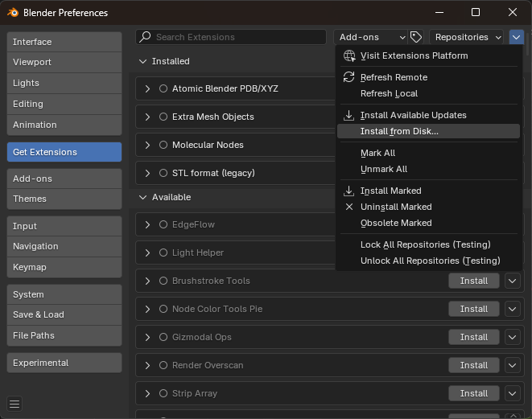
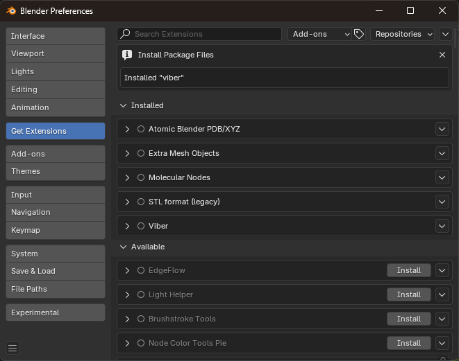
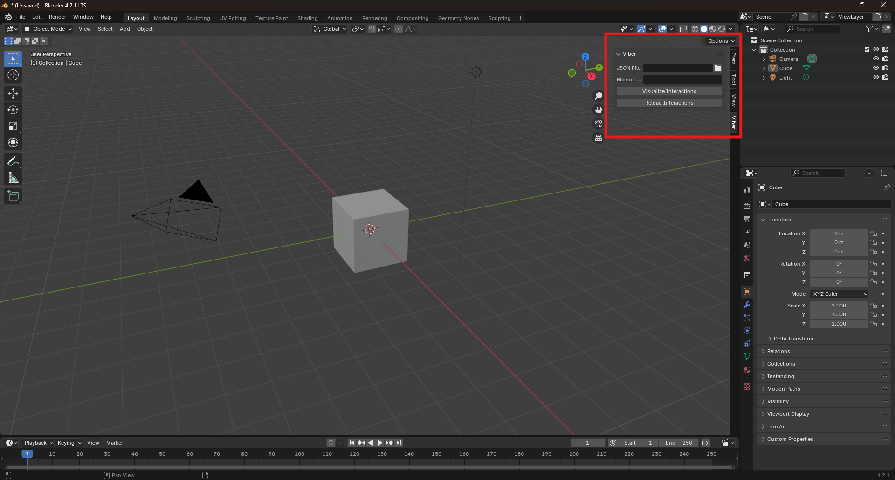
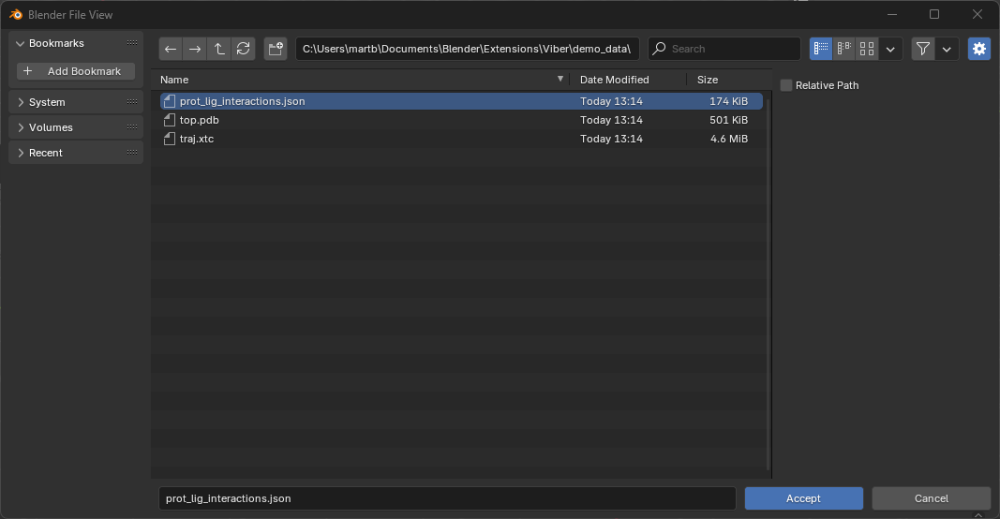
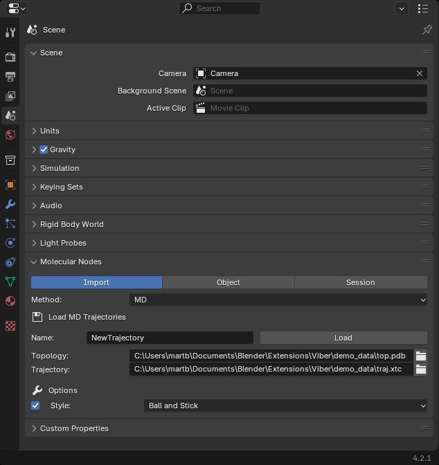

## Visualize Interaction in BlendER !!!

https://github.com/user-attachments/assets/0c77dc30-714b-4c04-85c4-d3ead070af56

To use this extension you will need:

- A few python libraries (tested only for the following versions):

    - MDAnalysis 2.6.1
    - PROLIF 2.0.3
    - Pandas 2.1.2

- Molecular Dynamics data (MDAnalysis compatible):

    - Topology
    - Trajectory

- The [Molecular Nodes](https://github.com/BradyAJohnston/MolecularNodes) extension from the amazing Brady Johnston.

- A JSON file containting indices of interacting atoms per interaction type and per frame.

## Prepare the data in a JSON format

```{.bash}
{
    "<Interaction_Type>": {
        "<Frame_Number>": [
            {
                "Ligand": [vertex_indices],
                "Protein": [vertex_indices]
            }
        ]
    }
}
```
You can follow the provided notebook the generate both data and structure easily.

## Install the extension

Download the ZIP file [here](https://raw.githubusercontent.com/MartinBaGar/Viber/main/viber-1.0.0.zip).

Install it in Blender :

Edit ‣ Preferences ‣ Get Extensions ‣ Extension Settings ‣ Install from Disk... ‣ Choose any location you like.



The extension should now be installed.



A new tab is now available in the Sidebar which can be toggled with the menu item View ‣ Sidebar or with the shortcut `N`.



## In-Blender use {#sec-use-viber}

Open the Viber pannel, load the JSON file without using a relative path (see @fig-json-path) and click on "Visualize Interactions" to create the interaction objects.
As frame-hanlders are used to assign the coordinates to each interaction object, you will need to change the frame to make the bonds appear.

{#fig-json-path}

For some reasons not identified yet, the coordinates updates can break leabing the objects at their last state. To repair that you just need to select your Molecular Nodes object to make it active and then just click on "Reload Interactions" and that's it !

## Mini tutorial

Load the topology and trajectory with Molecular Nodes.



Load your JSON file and create the interaction objects as described in the {#sec-use-viber}.

## Customization

For now customization is limited if you don't want to modify the code directly. You will only be able to modify the shader used to represent the interactions.
